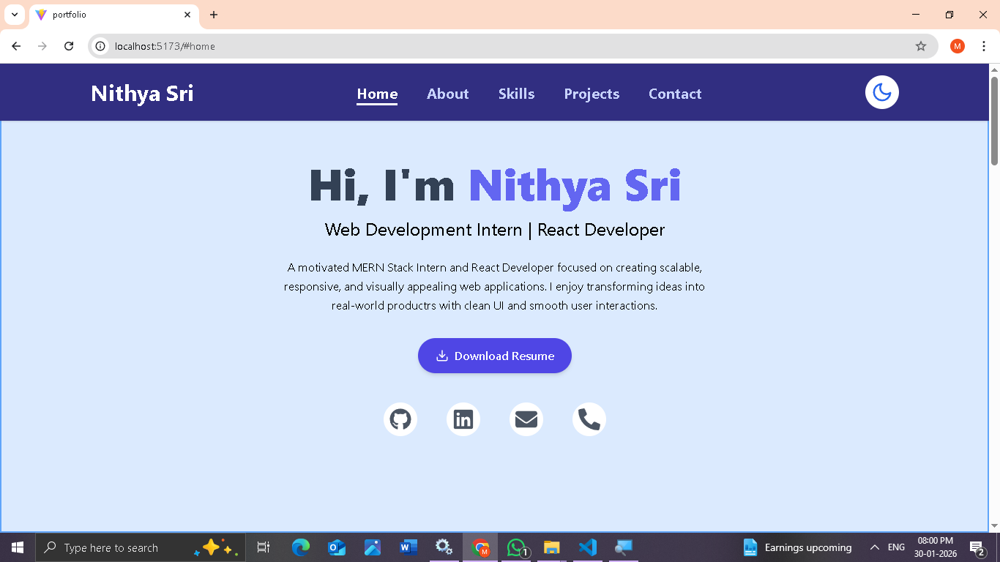
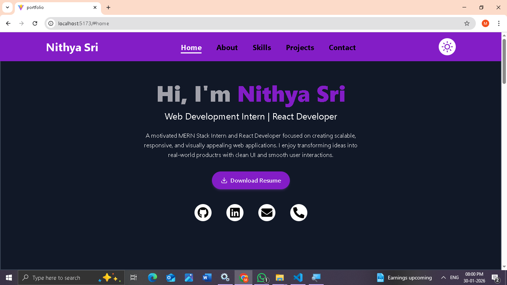
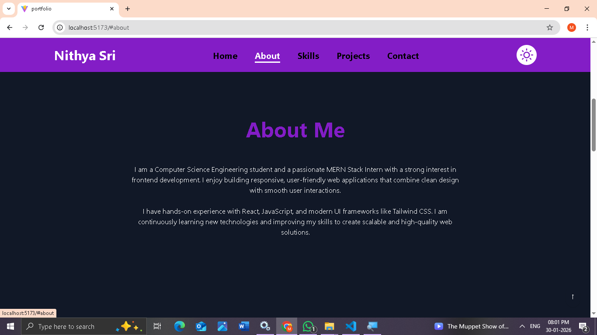
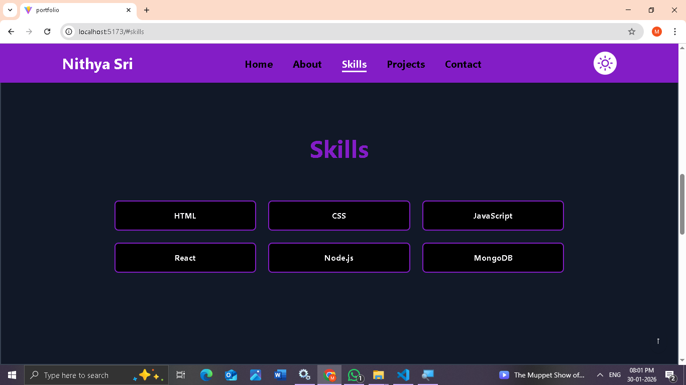
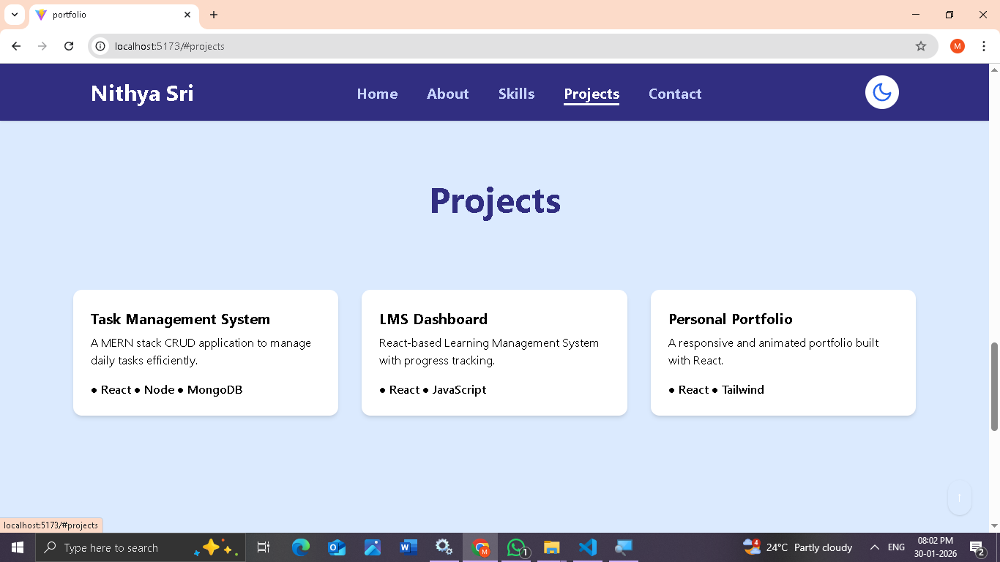
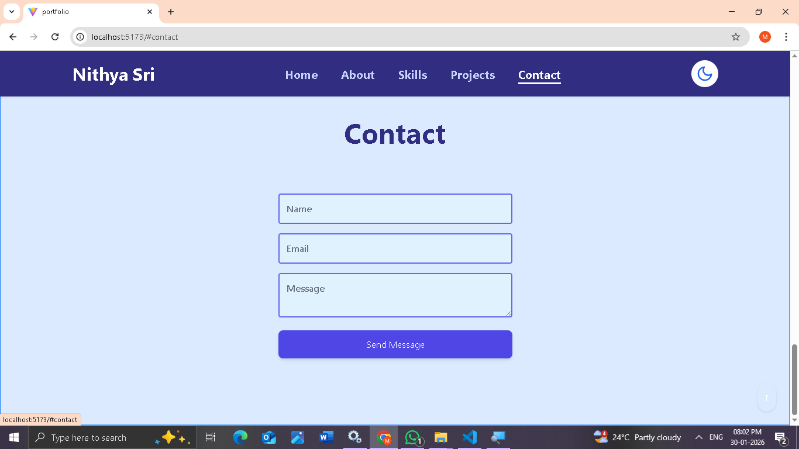

### Personal Portfolio Website 

A modern, responsive, and animated personal portfolio website built using *React.js with Vite*.  
This project focuses on *UI/UX quality, smooth interactions, responsiveness, and clean component-based architecture*.

##  Project Overview

This portfolio showcases my profile, skills, projects, and contact details in a single-page React application.  
It is built using *Vite for faster development, includes **dark/light mode*, smooth scrolling, animations, and a clean professional design.

##  Sections Included

- Home  
- About Me  
- Skills  
- Projects  
- Contact  

All sections are implemented as *separate reusable React components*.

## Features

- Single Page Application (SPA)
- Component-based architecture
- Built using *Vite + React*
- Fully responsive (Mobile, Tablet, Desktop)
- Dark / Light mode toggle
- Smooth scrolling navigation
- Hover effects and animations
- Animated section loading
- Download Resume button
- Social media links (GitHub, LinkedIn, Email, Phone)
- Scroll-to-top button
- Contact form (UI only) 

## Technologies

- *React.js*
- *Vite*
- *Tailwind CSS*
- *Framer Motion*
- HTML, CSS, JavaScript
- Git & GitHub

## Folder Structure

portfolio/
│
├── node_modules/
│
├── public/
│   ├── Nithyasri_Resume.pdf
│   └── vite.svg
│
├── src/
│   │
│   ├── assets/
│   │   └── react.svg
│   │
│   ├── components/
│   │   ├── About.jsx
│   │   ├── Contact.jsx
│   │   ├── Home.jsx
│   │   ├── Navbar.jsx
│   │   ├── Projects.jsx
│   │   ├── ScrollTop.jsx
│   │   └── Skills.jsx
│   │
│   ├── App.css
│   ├── App.jsx
│   ├── index.css
│   ├── main.jsx
│   └── theme.js
│
├── .gitignore
├── eslint.config.js
├── index.html
├── package-lock.json
├── package.json
└── README.md

## Setup Instructions
Follow the steps below to run the project locally on your machine.

## 1. Clone the Repository
git clone https://github.com/Nithya-Sri1611/portfolio.git

## 2. Navigate to the Project Folder
cd portfolio

## 3. Install Dependencies
npm install

## 4. Start the Development Server
npm run dev

## 5. Open in Browser
http://localhost:5173

## Application Screenshots

###  Desktop View
*Light Mode*

*Dark Mode*

###  Sections

#### About

#### Skills

#### Projects

#### Contact

## 6. Author
Nithya Sri 
MERN Stack Web Developer Intern

GitHub:
https://github.com/Nithya-Sri1611/portfolio.git

